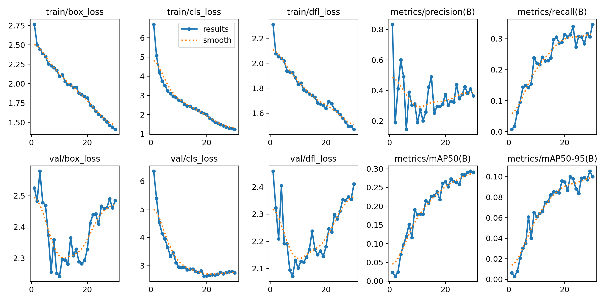
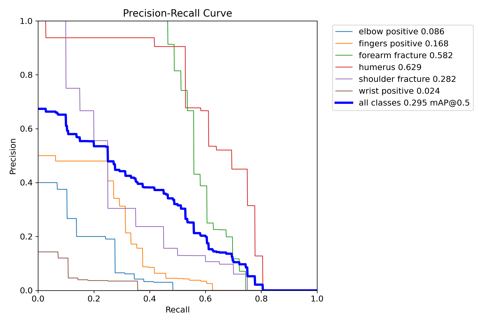
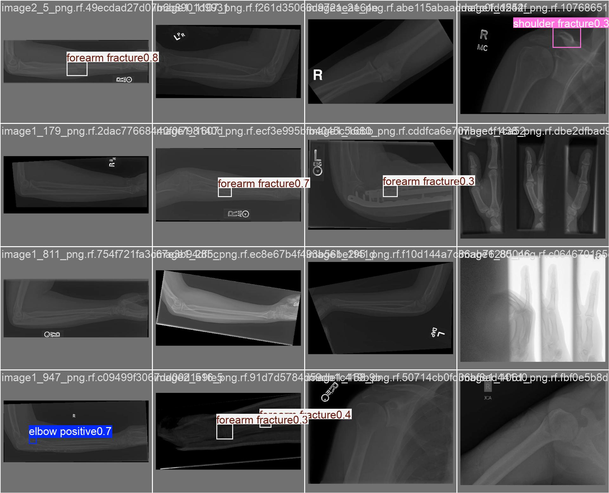

# Bone-Fracture-Classification
ML Model that specializes in highlighting potential fractures in arms, hands, legs and feet. 

# Bone Fracture Detection with YOLOv8

An object detection model that identifies and localizes bone fractures in X-ray images, trained using transfer learning on a pretrained YOLOv8 backbone.

## Overview
This project fine-tunes YOLOv8n (nano) to detect fractures across multiple bone regions — elbow, fingers, forearm, humerus, shoulder, and wrist — from X-ray images, drawing bounding boxes around detected fracture sites.

## Dataset
- **Source:** [Bone Fracture Detection: Computer Vision Project](https://www.kaggle.com/datasets/pkdarabi/bone-fracture-detection-computer-vision-project) (Kaggle)
- ~10,581 labeled X-ray images
- Classes: Elbow Positive, Fingers Positive, Forearm Fracture, Humerus Fracture, Shoulder Fracture, Wrist Positive

## Approach
- **Model:** YOLOv8n, pretrained on COCO, fine-tuned on the fracture dataset
- **Training:** 30 epochs, image size 640×640, batch size 16
- **Framework:** PyTorch via Ultralytics, trained on Google Colab (T4 GPU)

## Results

### Training curves


### Confusion matrix


### Precision-Recall curve


### Sample predictions (validation set)


**Final metrics:**
- mAP50: `[fill in]`
- mAP50-95: `[fill in]`

## How to run
1. Clone this repo
2. `pip install -r requirements.txt`
3. Download the dataset from Kaggle (or use your own X-ray images)
4. Load the trained weights:
```python
from ultralytics import YOLO
model = YOLO('weights/best.pt')
results = model.predict('path/to/xray.jpg', conf=0.25)
```

## Notes
This is a portfolio/learning project and is not intended for clinical use.

## Author
Isaiah Kim — built as part of a medical imaging ML portfolio, exploring applications in orthopaedic imaging.
